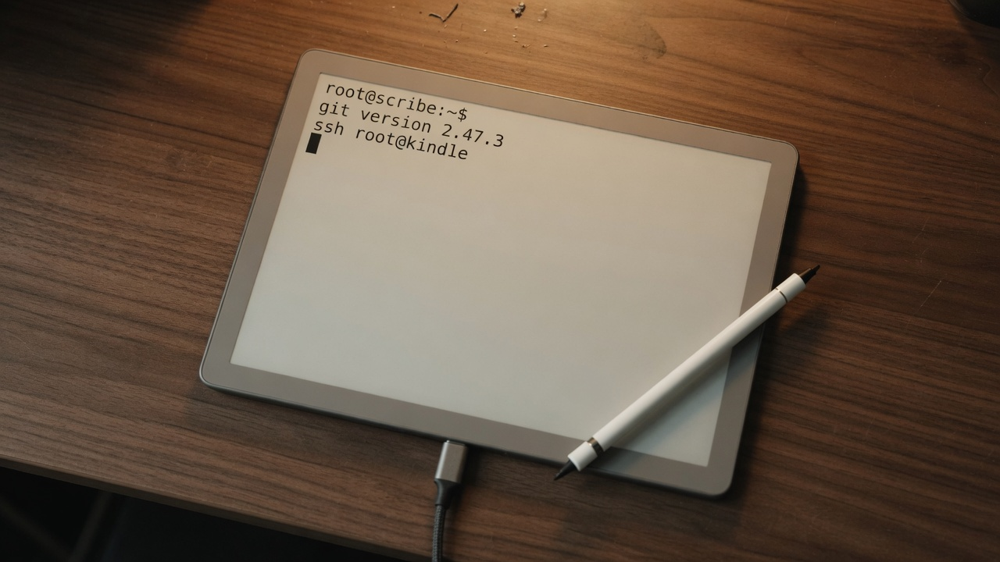

<p align="center">
  
</p>

<h1 align="center">kindle-userspace</h1>

<p align="center">
  <b>Amazon still boots. You still run your own binaries.</b>
</p>

<p align="center">
  Wi-Fi SSH · git 2.47 · vim 9.1 · static <code>linux/arm</code><br>
  Kindle Scribe · firmware 5.19.5 · <code>kindlehf</code>
</p>

<p align="center">
  <a href="docs/guide.md">Guide</a> ·
  <a href="docs/troubleshooting.md">Troubleshooting</a> ·
  <a href="LICENSE">MIT</a>
</p>

A Kindle is a Linux box Amazon sells as a storefront. After a public
jailbreak you already own `/mnt/us`. This repo is the missing userspace:
drop your own programs, get a shell over Wi-Fi, and run real git and vim
on a FAT volume that refuses every symlink Alpine throws at it.

**Not a jailbreak.** Bring your own Véra. No hotfix books, no firmware
dumps, no DRM tools.

## Why people brick this

`/mnt/us` is FAT. Toggle USBNet traps the UI on a gadget page you can
only leave by powering off. Extracting Alpine onto the userstore, or
`rm -rf` after a bind-mount, deletes the library.

This repo is the pipe that does not do those things.

## What's in the box

| You get | How |
|---------|-----|
| `ssh root@kindle` after every reboot | [`scripts/start-ssh.sh`](scripts/start-ssh.sh) — dropbear on wlan0, not USB gadget |
| `git version 2.47.3` | `just pack-git` — musl/armv7, flattened, no chroot |
| `vim 9.1` | `just pack-vim` — same shape |
| Your own CLI on the device | [`scripts/build-go.sh`](scripts/build-go.sh) → `linux/arm` `GOARM=7` |
| Files onto `/mnt/us` | [`scripts/mtp-put-dir.py`](scripts/mtp-put-dir.py) via `calibre-debug` |

```bash
just pack-git          # work/git-kindlehf.tar.gz
just pack-vim          # work/vim-kindlehf.tar.gz
./scripts/build-go.sh ./myapp-kindlehf ./cmd/myapp
```

Then the [guide](docs/guide.md): MTP the files, tap a `# Name:` scriptlet,
start SSH, unpack git.

## The one-liner that matters

```sh
# on the Kindle, after every reboot. Do not tap Toggle USBNet.
/mnt/us/bin/start-ssh
```

```sshconfig
Host kindle
  HostName YOUR_KINDLE_IP
  User root
  IdentityFile ~/.ssh/id_kindle
  IdentitiesOnly yes
```

## Docs

| | |
|--|--|
| [Guide](docs/guide.md) | Build, MTP, scriptlets, SSH, git, vim, ash hooks |
| [Troubleshooting](docs/troubleshooting.md) | Connection refused, host-key rotate, FAT, KUAL is dead |
| [SECURITY](SECURITY.md) | What never goes in this tree |

## License

MIT for the scripts. `just pack-git` / `just pack-vim` download Alpine
packages with their own licenses (git is GPL-2.0). Those blobs stay out
of git.
